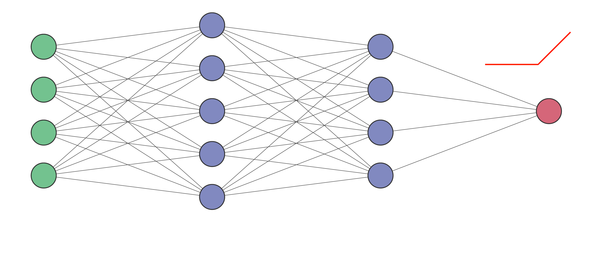

# fespn
A neural network made to predict final exam scores of students.

There are three files:
- mlp.py - For training the neural network and predicting the scores
- finalcal.py - For estimating the previous final exam scores based on the grade and internals
- internals.py - For calculating the internal marks for current semester

A neural network with ReLU activation function and Stochastic Gradient Descent as an optimizer (solver) has been used. It has two hidden layers with 5 and 4 nodes respectively.

### students_data.csv
name,roll no 1,roll no 2,phymse1,phymse2,bemse1,bemse2,mat1mse1,mat1mse2,bmemse1,bmemse2,esmse1,esmse2,mat2mse1,mat2mse2,beemse1,beemse2,ppsmse1,ppsmse2,engmse1,engmse2,egdmse1,egdmse2,attendance,full

### final_data.csv
name,phy_i,be_i,mat_i,bme_i,es_i,phy_g,be_g,mat_g,bme_g,es_g

This work is licensed under the [MIT License](/LICENSE). View the license file for details.